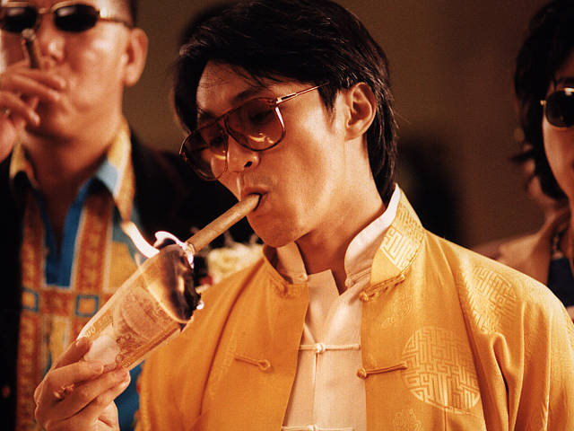

# **ASIA**

------

# Predictions

## China

### China attempts invading Taiwan in 2027

#### Pro

- It's a symbolic year. `(link to article missing)`
- The US is busy shooting up ammunition in Iran and doesn't have enough to fight two or more wars.

#### Con

- Hardest invasion in the history of mankind.
  - Taiwan's resilience is exceptionally high. Taiwan's defeat is the destruction of their identity.
